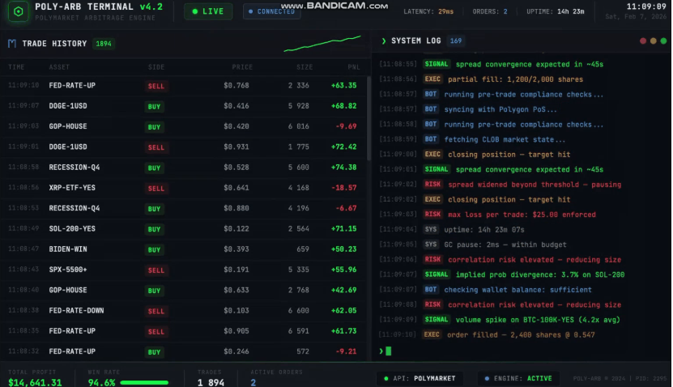

# Gabagool AI

**Short-horizon prediction for Polymarket crypto markets.** Predict whether the UP contract price will rise by ~$0.01–0.02 within 5 seconds, then train an ML model on real-time order book and spot data to drive a trading bot.




---

## Overview

This repository contains:

| Component | Stack | Role |
|-----------|--------|------|
| **Collector** | Rust (Tokio, WebSockets) | Streams Polymarket CLOB order book + optional RTDS crypto prices → JSONL. |
| **Training pipeline** | Python (PyTorch, pandas) | Builds features from book + spot, stream-based labels (UP/DOWN), trains a small MLP. |
| **Agent** | Python | Orchestrates collect → train → evaluate in one run. |

The model does **not** predict the 15-minute market resolution. It predicts a **short-period move**: UP token price (or spot) will rise by a configurable amount (e.g. 0.01–0.02) within a short horizon (e.g. 5 seconds), so you can trade on that signal.

---

## Requirements

- **Rust** (1.70+) — for `polymarket_collector`
- **Python** 3.10+ — for `polymarket_prediction` (see `polymarket_prediction/requirements.txt`)
- **Polymarket** CLOB and RTDS WebSocket access (public endpoints)

---

## Quick start

### 1. Build the collector

```bash
cd polymarket_collector
cargo build --release
```

### 2. Collect data (BTC 15m market + BTC/USD)

From the **repository root**:

```bash
./polymarket_prediction/scripts/collect_btc15m.sh
```

Run for at least **20–30 minutes**, then stop with `Ctrl+C`. Data is written to `polymarket_prediction/data/raw/market/` and `polymarket_prediction/data/raw/crypto/`.

### 3. Train

```bash
cd polymarket_prediction
pip install -r requirements.txt   # if needed
python -m src.train \
  --market-dir data/raw/market \
  --crypto-dir data/raw/crypto \
  --market-meta data/raw/processed/market_meta.csv \
  --horizon-sec 5 \
  --min-up-move 0.01
```

Optional: `--use-up-token-price` labels by UP contract mid price instead of spot. Model is saved to `models/model.pt`.

### 4. Evaluate

```bash
python -m src.evaluate \
  --model models/model.pt \
  --data data/processed/features.parquet \
  --horizon-sec 5 \
  --min-up-move 0.01 \
  --crypto-dir data/raw/crypto
```

Use `--use-up-token-price` if the model was trained with that option.

### 5. Agent (collect → train → evaluate in one go)

```bash
cd polymarket_prediction
python scripts/run_agent.py --collect-minutes 20 --epochs 80
```

Use `--skip-collect` to train/evaluate on existing data only.

---

## Project structure

```
gabagool_AI/
├── polymarket_collector/          # Rust: real-time data collection
│   ├── src/main.rs
│   ├── Cargo.toml
│   └── README.md
├── polymarket_prediction/         # Python: ML pipeline
│   ├── config/default.yaml       # horizon_sec, min_up_move, model, paths
│   ├── data/
│   │   ├── raw/                  # market/*.jsonl, crypto/*.jsonl (from collector)
│   │   └── processed/            # features.parquet, labels_5s.csv, market_meta.csv
│   ├── src/
│   │   ├── data/                 # load_ws, load_crypto, build_features, get_labels
│   │   ├── model/                # MLP (PyTorch)
│   │   ├── train.py
│   │   └── evaluate.py
│   ├── scripts/
│       ├── collect_btc15m.sh     # BTC 15m + btcusdt collection
│       └── run_agent.py          # collect → train → evaluate
│    
│       
│       
│       
└── README.md                     # this file
```

---

## Configuration

Key settings live in `polymarket_prediction/config/default.yaml`:

| Section | Key | Description |
|---------|-----|-------------|
| **data** | `horizon_sec` | Label horizon in seconds (default: 5). |
| **data** | `min_up_move` | Minimum price rise to label UP (e.g. 0.01 or 0.02). |
| **data** | `use_up_token_price` | If true, label by UP token mid; if false, by spot. |
| **data** | `crypto_symbol` | Spot symbol for features/labels (e.g. `btcusdt`). |
| **model** | `hidden_dims` | MLP hidden layers (e.g. `[128, 64, 32]`). |
| **training** | `epochs`, `batch_size`, `lr` | Training hyperparameters. |

Override via CLI (e.g. `--horizon-sec`, `--min-up-move`, `--use-up-token-price`) when running `train` or `evaluate`.


## License

See repository license file (if present). Use at your own risk; no warranty for trading or financial decisions.
